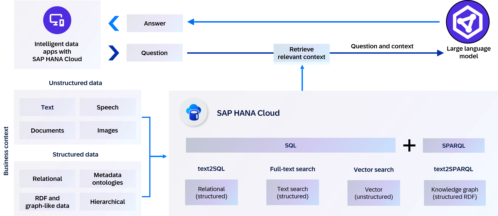
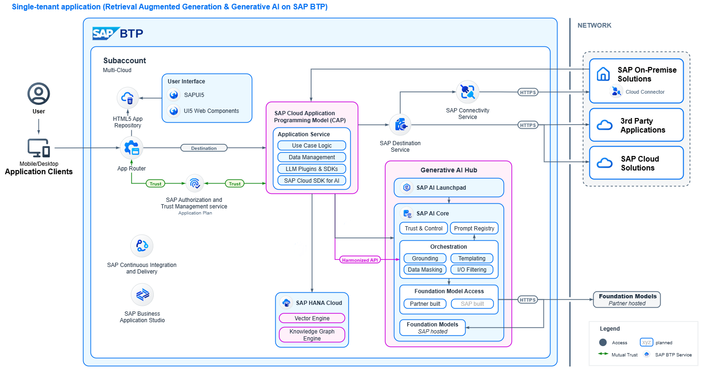

In this mission, we will explore how to build RAG (Retrieval-Augmented Generation) using **SAP HANA Cloud** and **SAP Generative AI Hub**. RAG is a modern and powerful approach to improving the quality of answers generated by large language models (LLMs). The goal is to equip you with the knowledge and tools to combine both unstructured and structured data retrieval for generating more accurate, grounded, and context-aware responses.

By harnessing the power of vector-based semantic search, you can retrieve relevant passages from unstructured business content, such as documents, emails, and wikis. In parallel, the knowledge graph engine enables precise querying of structured enterprise data—such as product relationships, asset hierarchies, or organizational roles—via semantic graphs stored in **SAP HANA Cloud**.

Further, we will introduce the hybrid approach that enables the LLM to generate more accurate, comprehensive, and trustworthy responses, making it especially valuable in enterprise applications, customer support, healthcare, legal, and scientific domains where both nuance and factual accuracy matter. You will learn how to use Vector similarity search and SPARQL queries to retrieve and analyze supplier information from both unstructured and structured data. 

### Business Problem
John, a computer reseller, manages a large and diverse inventory of hardware products and accessories sourced from multiple suppliers. While product and vendor data is stored in SAP S/4HANA, he faces challenges to make informed and timely decisions, resulting in missed opportunities and operational inefficiencies.

1. **Product Search**: Product descriptions contain valuable information (brand, rating, performance, complementary offerings, etc.) that is not easily searchable or filterable.
2. **Accessiry Compatibility**: Traditional keyword-based search methods are inadequate for handling unstructured descriptions.
3. **Vendor Reliability**: There's a need to quickly identify the suppliers reliability based on the historical records.

### Desired Solution

To address the challenges John faces in managing and utilizing product and vendor data, we propose building an intelligent product and vendor discovery application using a hybrid Retrieval-Augmented Generation (RAG) architecture. This solution will combine the strengths of SAP HANA Cloud’s vector engine, SAP HANA Cloud knowledge graph engine, and Large Language Models (LLMs) via SAP Generative AI Hub.

1. Accept **natural language queries** from users to search for products that match specific customer needs.
2. Create ontologies for tabular data of vendor reliability, product and supplier relationships in a **knowledge graph**.
3. Retrieve both similarity search and graph-based results and pass to the **LLM**.
4. Build a **front-end interface** in SAP Business Application Studio to enable easy interaction for John and his team.

### Technical Implementation

As part of this mission, you will be expected to carry out the following:
1. Use the **SAP Generative AI Hub** to deploy LLMs for embedding, and response generation processes.
2. Leverage the **GenAI Hub SDKs** to generate context-aware text chunks, embed them, and store the resulting **vector embeddings** in SAP HANA Cloud.
3. Create **ontology** for tabular data as a **Knowledge Graph** in SAP HANA Cloud, capturing entities and relationships to enable semantic graph queries.
4. Implement **Hybrid RAG** by combining semantic search from the vector engine with fact-based retrieval from the knowledge graph. This dual-source retrieval ensures both contextual relevance and structural accuracy in LLM responses.
5. Prompt the **GPT-4o** model with the user query and the most relevant retrieved context to generate accurate, grounded responses.

