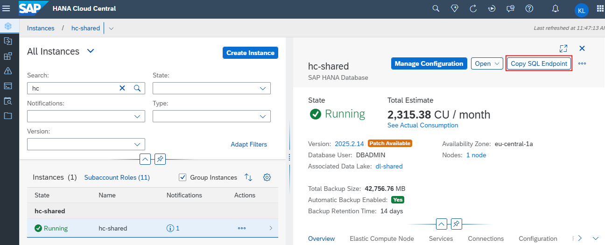

There are several development environments available for running Python notebooks. In this mission, we will be using **SAP Business Application Studio** as the primary tool. However, you are also free to use alternatives such as Visual Studio Code or other compatible editors, depending on your preference and development setup.

1. Open your own **SAP Business Application Studio**

2. Choose **Create Dev Space** to create a virtual environment in which to start a project. 

    

3. Enter Dev Space name, for example, **User001_VectorDB**, choose **SAP HANA Native Application** as a type of application and **Python Tools** from the list of Additional SAP Extensions, and **Create Dev Space** to start the environment.
    
    
    
4. It will take a few minutes start the Dev Space. Once the status changes to **Running**, click on the name of your dev space to open it. 

    

5. Choose **OK** to accept the Privacy Statement. 

    

6. Choose the **Get Started** tab, and choose **Clone from Git** to import a repository from Github.

    

7. A prompt will appear on top asking for the repository URL. Copy and paste the following URL and then press **Enter**.

    ~~~url
    https://github.com/songlinl/sap-genai-hub-with-sap-hana-cloud-vector-engine.git
    ~~~

    

8. Choose **Open** to see the imported files in the Explorer window.

    

9. The files should now be visible in the Explorer pane on the left hand side. Create a **.env** file to store the credentials to access SAP AI Core service and SAP HANA Cloud database.  
    Right-click on the white space and chpose **New File...**

    

10. Type **.env** and press Enter.

    

11. Open the downloaded service key file or go to your BTP subaccount -> Services -> Instances and Subscriptions find your AI core instance, open the key file. 

    

12. Enter environment parameters for the **.env** file.  
      
      
      
    Copy and paste the environment parameters below into your `.env` file, and replace the placeholder values with your own configuration details.   

    ~~~env
    ## Credentials for accessing SAP AI Core service models
    AICORE_AUTH_URL = '<url>'
    AICORE_CLIENT_ID = '<Clientid>'
    AICORE_CLIENT_SECRET = '<Clientsecret>'
    AICORE_BASE_URL = '<API_AI_URL>'
    AICORE_RESOURCE_GROUP = '<Resource Group>'

    ## Credentials for accessing SAP HANA Cloud database
    HANA_VECTOR_HOST = '<SQL endpoint>'
    HANA_VECTOR_USER = '<Database User>'
    HANA_VECTOR_PASS = '<Database password>'
    ~~~

    Below is an example, for demonstration purpose only. 

    

    > [!TIP] To understand from where we obtained the credentials for SAP AI Core service, please see <a href="https://help.sap.com/docs/sap-ai-core/sap-ai-core-service-guide/enabling-service-in-cloud-foundry" target="_blank">SAP AI Core - Enabling the Service in Cloud Foundry</a>

