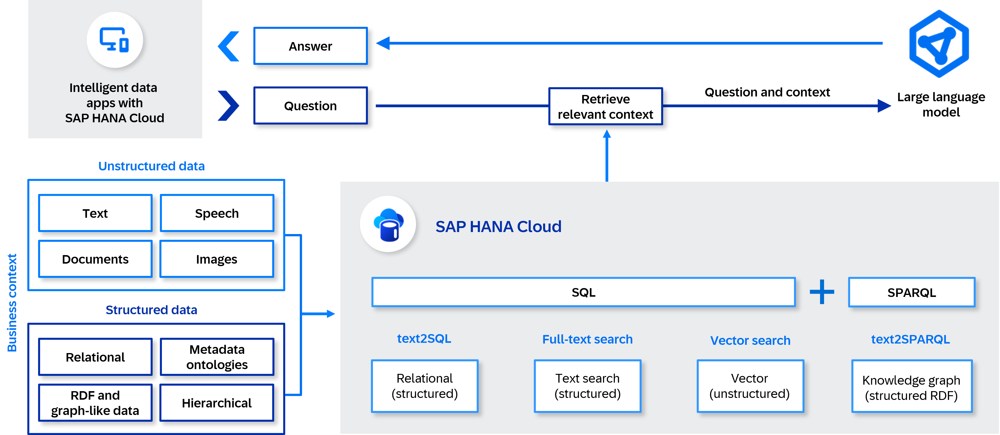
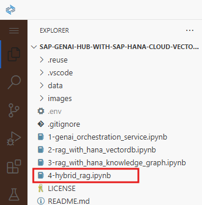
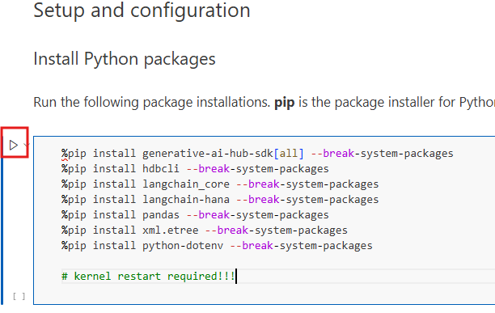

# Hybrid RAG with SAP HANA Cloud Vector and Knowledge Graph Engines

## Introduction

In this use case, we will embark on a journey to explore the hybrid integration of the **SAP HANA Cloud vector engine**, **SAP HANA Cloud knowledge graph engine**, and **SAP Generative AI Hub**, using the **LangChain** (Python) framework to build next-generation LLM-powered applications. The goal is to equip you with the knowledge and tools to combine both unstructured and structured data retrieval for generating more accurate, grounded, and context-aware responses.

By harnessing the power of vector-based semantic search, you can retrieve relevant passages from unstructured business content, such as documents, emails, and wikis. In parallel, the knowledge graph engine enables precise querying of structured enterprise data—such as product relationships, asset hierarchies, or organizational roles—via semantic graphs stored in **SAP HANA Cloud**.

This section utilizes Jupyter notebooks deployed in **SAP Business Application Studio (BAS)** to demonstrate how both retrieval methods can be orchestrated together in a hybrid Retrieval-Augmented Generation (RAG) pattern. The integration of SAP Generative AI, **SAP HANA Cloud**, and the LangChain framework showcases how to build advanced, trustworthy AI applications that blend the flexibility of semantic search with the reliability of structured knowledge.

**Hybrid Retrieval Augmented Generation (RAG) workflow**

1. Business content and structured enterprise data are prepared:
    - Unstructured and semi-structured content (e.g., documents, knowledge base articles) are preprocessed and chunked for vector-based retrieval.
    - Structured data (e.g., product metadata, organizational hierarchies) is modeled as entities and relationships in a knowledge graph.

2. Document chunking is applied to break large text files into smaller, manageable pieces suitable for semantic indexing.

    >📝**Note**: "Chunking" enables finer-grained retrieval, ensuring that responses are grounded in the most relevant segment of a document.

3. Embeddings are generated from the text chunks using models from SAP Generative AI Hub, producing dense vector representations of each chunk.

    >📝**Note**: Embeddings allow the system to search by meaning rather than keywords.

4. The generated embeddings are stored in SAP HANA Cloud’s vector engine, enabling high-performance semantic search over unstructured data.

5. In parallel, structured data is ingested into the SAP HANA Cloud knowledge graph engine, representing entities and their relationships for logical querying.

6. A user submits a natural language query (e.g., “What accessories are available for the HP ZBook?”).

7. The query is processed by the LLM or NLP parser to identify:
    - Semantic content for vector retrieval
    - Entities and intent for structured graph querying

8. Two retrieval operations happen in parallel:
    - The vector engine retrieves semantically similar document chunks using vector similarity search.
    - The knowledge graph engine executes a structured graph query to retrieve factual or relational information (e.g., product hierarchies, valid part numbers, supplier info).

9. The retrieved content from both engines is merged, ranked, or filtered using LangChain or custom logic to ensure relevance and reduce duplication.

10. The combined context (documents + graph facts) is passed, along with the original query, to a large language model such as GPT-4o via the RAG pipeline.

11. The LLM generates a response grounded in both semantically relevant text and factually accurate structured data, returning a coherent, context-rich, and trustworthy answer to the user.

## Configure Jupyter and Python Extensions

1. Open Jupyter Notebook **4-hybrid_rag.ipynb**.  

    

2. Read through the notebook until you get to the first code cell in the Setup and configuration section.

3. Run the first code cell to install the required python modules.

    >📝**Note**: To execute a code cell, click on the play icon beside the cell. It is also possible to execute it by clicking into the code cell and pressing ***Shift+Enter***.

    

5. On the next screen, choose the recommended **Python 3.13**. 

    

6. The required libraries will now start installing. Once the libraries have been successfully installed, the kernel must be restarted. Choose **Restart** in the menu on the top.

    

7. On the following pop-up window, Choose **Restart**. It will take a few seconds for the kernel to restart and once done, the environment is ready for use!

    

8. Please follow the step-by-step instructions provided in the **Jupyter Notebook** to complete the remaining parts of the exercise.
