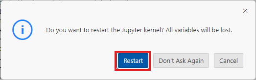

# Retrieval Augmented Generation with SAP HANA Knowledge Graph Engine

## Introduction

In this use case, we will embark on a journey to explore the openness and interoperability between the **SAP HANA Cloud knowledge graph engine**, **SAP Generative AI Hub**, and the **LangChain** (Python) Framework for developing LLM-powered applications. The goal is to equip you with the knowledge and skills to handle structured, entity-rich data and build applications that generate accurate, context-aware responses.

Leverage the power of Knowledge Graphs to model relationships between entities—such as products, customers, suppliers, or assets—in a way that is both semantic and queryable. With **SAP HANA Cloud**, structured data can be stored as a graph and accessed using SPARQL queries. This structured context is then integrated into LLM workflows via **SAP Generative AI Hub** and **LangChain**, allowing you to ground generative responses in verifiable enterprise knowledge.

This section utilizes Jupyter notebooks deployed in **SAP Business Application Studio (BAS)** to demonstrate how to integrate structured, graph-based retrieval into a **Retrieval Augmented Generation (RAG)** application. The combination of **SAP Generative AI Hub**, **SAP HANA Cloud knowledge graph**, and the **LangChain** framework highlights a robust architecture for building trustworthy, explainable AI systems in enterprise scenarios.

**Knowledge Graph Retrieval Augmented Generation (RAG) workflow**

1. Business entities and relationships that should be used for answering user questions are modeled and loaded into the knowledge graph. This includes structured data such as product catalogs, employee hierarchies, asset networks, and more.  
    >📝**Note**: A knowledge graph represents real-world entities (nodes) and their relationships (edges) in a semantic, queryable format. It allows machines to reason over the data and infer new relationships.
2. The structured data is enriched with ontologies or metadata to define types, hierarchies, and relationships. This ensures that the graph captures not just data, but context and meaning.

3. The enriched knowledge graph is stored in SAP HANA Cloud using its graph engine capabilities, allowing efficient storage and traversal of relationships using SPARQL queries.
4. A user query or prompt is submitted to the system.
5. The query is parsed and interpreted, either by rules, natural language understanding (NLU), or using an LLM to extract entities and intent.
6. A graph query is dynamically constructed or retrieved from a template to match the query intent. This query is then executed on the SAP HANA Cloud knowledge graph.
7. The most relevant facts, entities, or paths are retrieved from the graph—these are often concise, relational, and accurate answers grounded in structured data.
8. The retrieved graph-based information is combined with the original user query and forwarded to a large language model such as GPT-4o.
9. The LLM uses the graph results to enrich and ground its response generation. The final answer is both semantically rich and factually precise, and is returned to the user.

## Configure Jupyter and Python Extensions

1. Open Jupyter Notebook **3-rag_with_hana_knowledge_graph.ipynb**.  

    

2. Read through the notebook until you get to the first code cell in the Setup and configuration section.

3. Run the first code cell to install the required python modules.  

    >📝**Note**: To execute a code cell, click on the play icon beside the cell. It is also possible to execute it by clicking into the code cell and pressing ***Shift+Enter***.

    

5. Choose the recommended **Python 3.13**. 

    

6. The required libraries will now start installing. Once the libraries have been successfully installed, the kernel must be restarted. Choose **Restart** in the menu on the top.

    

7. On the following pop-up window, Choose **Restart**. It will take a few seconds for the kernel to restart and once done, the environment is ready for use!

    

8. Please follow the step-by-step instructions provided in the **Jupyter Notebook** to complete the remaining parts of the exercise.
