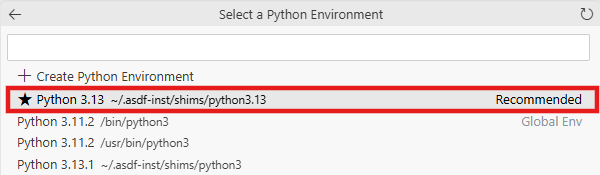

# Retrieval Augmented Generation with SAP HANA Cloud Vector Engine

## Introduction

In this use case, we will explore the openness and interoperability between the **SAP HANA Database vector engine**, **SAP Generative AI Hub**, and focusing on the **LangChain** (Python) Framework for developing LLM applications. The goal is to equip you with the knowledge and skills to handle unstructured and semi-structured data and build efficient applications.

Harness the power of Large Language Models (LLMs) from **SAP Generative AI Hub** to embed structured and semi-structured data. Once embedded, this data is stored in **SAP HANA Cloud**, enabling seamless storage and querying of vector embeddings.

This section utilizes Jupyter notebooks deployed in **SAP Business Application Studio (BAS)** to demonstrate leveraging a vector-based semantic search to implement a simple Q&A application using the Retrieval Augmented Generation (RAG) pattern. The integration of **SAP Generative AI**, **SAP HANA Database vector engine**, and **LangChain** framework showcases their combined strengths, emphasizing the ease and effectiveness of building advanced LLM applications with these interoperable tools.

**Retrieval Augmented Generation (RAG) workflow**

1. Business documents that should be used for answering user questions are fed into the model. The contents of the files are split into smaller chunks.  

    >📝**Note**: "Chunking" (and sometimes called "LLM chunking") refers to dividing a large text corpus into smaller, manageable pieces or segments. Each recursive chunking part acts as a standalone unit of information that can be individually indexed and retrieved. 

2. Embedding functions are used to create embeddings from the file/document chunks.  

    >📝**Note**: Embeddings refer to dense, continuous vectors representing text in a high-dimensional space. These vectors serve as coordinates in a semantic space, capturing the relationships and meanings between words. 

    
    
3. The embeddings are then stored as vectors in the SAP HANA Cloud Database.
4. A query or prompt is submitted.
5. The query is embedded into a vector form.
6. The query vector is compared to the values stored as vectors in SAP HANA Cloud via a similarity/semantic search.
7. The most appropriate and relevant results are identified.
8. These results are then forwarded, along with the original query, to a large language model such as GPT-4o.
9. The LLM uses the results of the HANA vector search to augment its own searching capabilities, and the final answer is returned to the user.

## Configure Jupyter and Python Extensions

1. Open Jupyter Notebook **2-rag_with_hana_vectordb.ipynb**.  

    

2. Read through the notebook until you get to the first code cell in the Setup and configuration section.

3. Run the first code cell to install the required python modules.  

    >📝**Note**: To execute a code cell, click the play icon beside the cell. It is also possible to execute it by clicking into the code cell and pressing ***Shift+Enter***.

    

4. When the first cell is executed, it will ask to choose a kernel source. Choose **Python Environments**.

    

5. On the next screen, choose the recommended **Python 3.13**. 

    

6. The required libraries will now start installing. Once the libraries have been successfully installed, the kernel must be restarted. Choose **Restart** in the menu on the top.

    

7. In the following pop-up window, Choose **Restart**. It will take a few seconds for the kernel to restart. After it restarts, the environment is ready for use!

    

8. Follow the step-by-step instructions provided in the **Jupyter Notebook** to complete the remaining parts of the exercise.