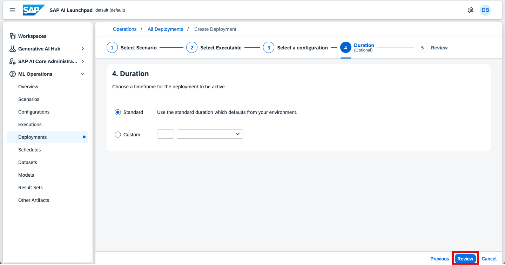

### Deploy Large Language Models (LLM) 

1. Expand ML Operations menu on the left and click **Configurations**. 
    
    You need to create a configuration of the model you are going to use. Click the **Create** button on the top right of the list.

    

    Let's first create a configuration for the **text embedding** model.

    Once you click the Create button, you will see a wizard.  

2. In the form, please fill in the following information:

   - Configuration Name: **openai-embedding-config**
   - Scenario: **foundation-models**
   - Version: **0.0.1**
   - Executable: **azure-openai**

   

    Click the **Next** button to move to the next step. 

3. In the form, please fill in the following information:

   - modelName: **text-embedding-ada-002** 
   > [!TIP] The model name needs to be exactly the same as specified
   - modelVersion: **latest** 
   > [!TIP] You can also enter a version number listed in <a href="https://me.sap.com/notes/3437766" target="_blank">SAP documentation</a>. In this exercise, let's use the latest

   

   Click the **Next** button to move to the next step.  

4. In our case adding input artifacts is not applicable. Click the **Review** button to move to the next step.

5. You will see all details you have entered so far. 
    
    If there is nothing to change, click the **Create** button to move to the next step. 

    

6. Notice that Configuration ID is generated.
 
    Click the **Create Deployment** button to the top right.

    

    You will be automatically navigated to the Deployments wizard. 
    Because you continued your workflow from the configuration step, you will automatically skip the deployment steps 1 to 3, and come to step 4 of the wizard. 

7. You will see two duration options, Standard vs Custom.  
   
    The Standard option should be selected already. Click the **Review** button to move to the next step

    

8. Review the details and click the **Create** button to move on. 

    

    **Now the deployment has started.** Monitor the status changes here. 

    On the deployment screen, you can see the Target Status is **RUNNING** and in the beginning, the Current Status is **UNKNOWN**.  Also, the deployment URL says *URL isn't available* until the model is deployed. 

    > [!TIP] The deployment process usually takes between 2 to 10 minutes, sometimes even longer, depending on the server's status, network, the number of parallel jobs, etc.  You can refresh the status by clicking the refresh icon on the top right of the screen. In the meanwhile, feel free to proceed with the steps below.

    

9. While you are waiting for your first model to be deployed, repeat the steps detailed above to deploy a **gpt-4o** model. 

    Again, follow the wizard. When it comes to "Enter Name and Executable", please fill in the followings:

    - Configuration Name: **openai-gpt-4o-config**
    - Scenario: **foundation-models**
    - Version: **0.0.1**
    - Executable: **azure-openai**

    

    When it comes to "Input Parameters", please fill in the following:

    - modelName: **gpt-4o** 
    > [!TIP] The model name needs to be exactly the same as specified
    - modelVersion: **latest** 
    > [!TIP] You can also enter a version number listed in <a href="https://me.sap.com/notes/3437766" target="_blank">SAP documentation</a>. In this exercise, let's use the latest

    

    Proceed with creating configuration and deploying the model.

10. While you are waiting for your first two models to be deployed, repeat the steps detailed above to deploy a **claude-3.5** model. 

    Again, follow the wizard. When it comes to "Enter Name and Executable", please fill in the followings:

    - Configuration Name: **anthropic-claude-3.7-sonnet-config**
    - Scenario: **foundation-models**
    - Version: **0.0.1**
    - Executable: **aws-bedrock**

     

    When it comes to "Input Parameters", please fill in the following:

    - modelName: **anthropic--claude-3.7-sonnet** 
    >💡**Tip**: The model name needs to be exactly the same as specified
    - modelVersion: **latest** 
    >💡**Tip**: You can also enter a version number listed in <a href="https://me.sap.com/notes/3437766" target="_blank">SAP documentation</a>. This exercise uses the `latest`.

     

    Proceed with creating configuration and deploying the model.

After some time you should see all models deployed and running. 

