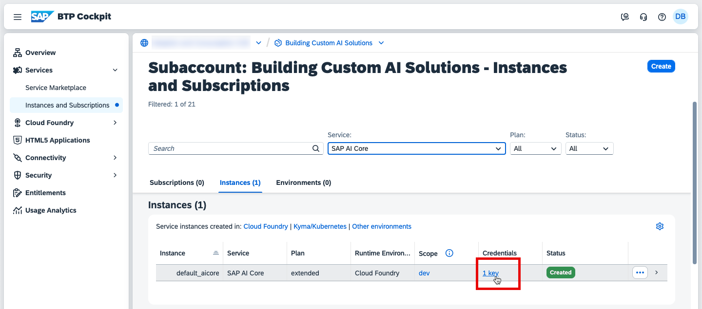

### Set Up SAP AI Core

1. Navigate to your global account and choose the **Boosters** tile.
   
    Choose the **Set Up Account for SAP AI Core** booster.

    

2. Choose **Start**.

    Make sure that ***All required prerequisites are met*** and choose **Next**.

    

3. Choose **Select Subaccount** mode for the booster and choose **Next**.

    

4.  Configure your Cloud Foundry Subaccount and Space with the following:

    - Plan: `extended`
    - Subaccount: `Building Custom AI Solutions`
    - Org: `building-custom-ai-solutions`
    - Space: `dev`

    

    Choose **Next**.   

5. Choose **Finish**.

### Configure AI API Connection
   
1. Navigate to your subaccount -> **Instances and Subscriptions** tab and filter the list with `SAP AI Core` to show the SAP AI Core service instance.

    Notice that the **Credentials key** has already been created by the booster. Click on it.

    

    Choose **Download**.

    

2. Navigate back to the **SAP AI Launchpad** homepage and choose **Add** to add the connection.

    

    Click **Upload icon** to upload the service key you downloaded in the previous step. Notice that the values are populated automatically. 

    Specify the **Connection Name** as `default` and choose **Create**.

    

    Notice that the workspace is set automatically (this may take some time). 
    
     >💡**Tip**: This includes a default resource group that has been automatically created under **Resource Groups**.
     > A resource group is used to connect with all computing resources needed for an AI workflow.  It also isolates your own workflow from other users' workflows. You can create more resource groups if needed. 

    
