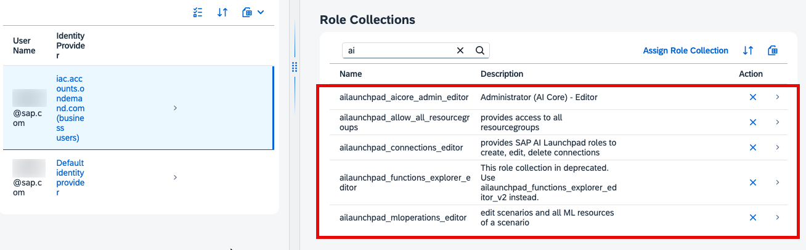

### Set Up SAP AI Launchpad

1. Navigate to your global account and choose **Boosters** tile.
   
   Choose **Set Up Account for SAP AI Launchpad** booster

   

2. Choose **Start**.

    Make sure that ***All required prerequisites are met*** and choose **Next**.

    

3. Choose **Select Subaccount** mode for the booster and choose **Next**.

    

4.  Configure your Cloud Foundry Subaccount and Space with the following:

    - Subaccount: `Building Custom AI Solutions`
    - Org: `building-custom-ai-solutions`
    - Space: `dev`

    Choose **Next**.

    

5. Choose **Finish**.
   
6. Navigate to your subaccount -> **Instances and Subscriptions** tab and validate that you can access SAP AI Launchpad by opening it in incognito window.

    

    Log in with your IAS user. You should see the **SAP AI Launchpad** homepage with no AI API connections (for now). Don't close this tab.

    

    > [!TIP] In case you are facing *Forbidden* error, validate that the user with which you are logging in has the following roles assigned:
    > - **ailaunchpad_aicore_admin_editor**
    > - **ailaunchpad_allow_all_resourcegroups**
    > - **ailaunchpad_connections_editor**
    > - **ailaunchpad_functions_explorer_editor**
    > - **ailaunchpad_mloperations_editor**
    > 
    > 

