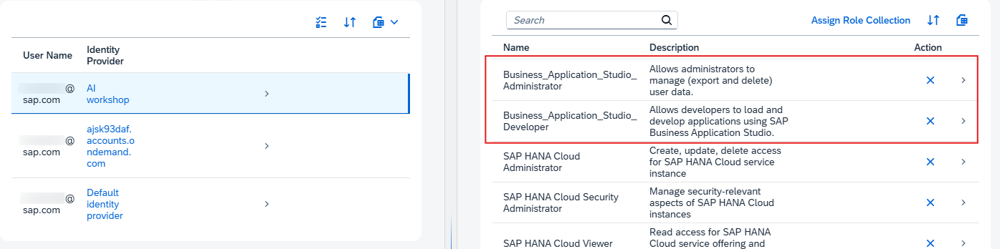

### Set Up SAP Business Application Studio

>[!NOTE] We are setting up SAP Business Application Studio to access the design-time environment.

1. Navigate to your global account and Choose **Boosters**.
   
   Choose **Get Started with SAP Business Application Studio** booster
 
    

2. Choose **Start**.

    

3. Make sure that ***All required prerequisites are met*** and choose **Next**.

    

4. Choose **Select Subaccount** mode for the booster and choose **Next**.

    

5.  Configure your Cloud Foundry Subaccount and choose **Next**.

    

6. If multiple people from your organization are participating in this workshop, choose the identity provider and add their email addresses to the ***Administrators*** and ***Developers*** fields.
   Choose **Next**.

    

7. Choose **Finish**.

8. Navigate to your subaccount -> **Instances and Subscriptions** and validate that you can access SAP Business Application Studio by opening it in incognito window.

    

    Log in with your user. You should see the **Welcome to SAP Business Application Studio** homepage.

    

    > [!TIP] In case you are facing *Forbidden* error, validate that the user with which you are logging in has the following role collections assigned:
    >- **Business Application Studio Administrator** 
    >- **Business Application Studio Developer**
    > 
    > 