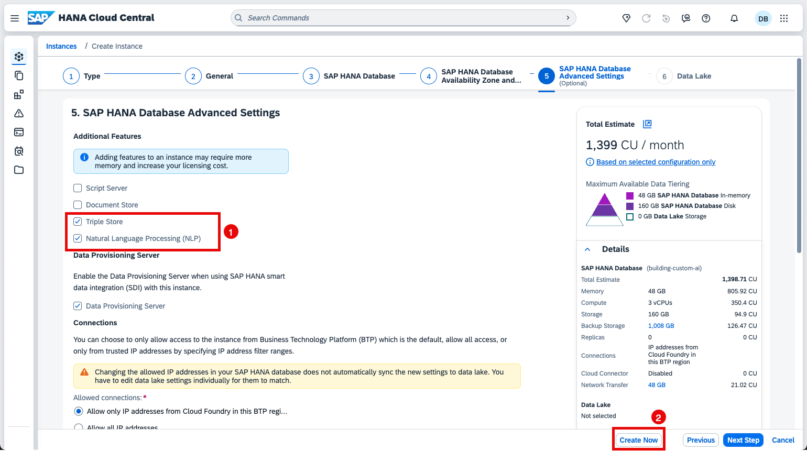

### Set Up SAP HANA Cloud

>⚠️**Important**: If you already have an SAP HANA Cloud instance in the same BTP region, you can skip running the booster. You only need to add **Triple Store** and **Natural Language Processing (NLP)** to your SAP HANA Cloud database configuration. Optionally, you can also enable the **Document Store** if you plan to complete the optional exercise.  
>

### Run the Booster

1. Navigate to your global account and choose the **Boosters**.
   
   Choose the **Set Up SAP HANA Cloud Administration Tools** booster.

    

2. Choose **Start**.

    

3. Make sure that ***All required prerequisites are met*** and choose **Next**.

    

4. Choose **Select Subaccount** mode for the booster and choose **Next**.

    

5. Choose your BTP Subaccount and choose **Next**.

    

6. If multiple people from your organization are participating in this workshop, choose the identity provider and add their email addresses to the ***Administrators*** and ***Developers*** fields.
   Choose **Next**
    
    

7. Choose **Finish**.

### Create SAP HANA Cloud Instance

1. Navigate to your subaccount -> **Instances and Subscriptions** tab and validate that you can access SAP HANA Cloud Central by opening it in an incognito window.

    

    >💡**Tip**: If a *Forbidden* error apprears, make sure you're logging on with the following role collections assigned:
    > - **SAP HANA Cloud Administrator**
    > - **SAP HANA Cloud Viewer**

2. Choose **Create Instance**.

    

3. Choose the following properties: 
    - Type: **SAP HANA Cloud, SAP HANA Database**  
    - Runtime Environment: **Cloud Foundry** 
    - Space: **dev**
   
    Choose **Next Step**.

    

4. Specify an appropriate name for the instance, set the Administrator Password for DBADMIN user, and choose **Next Step**.

    

5. Increase the **Memory** to **48** GB. 

    >⚠️**Important**: A minimum of **48 GB** of memory is required to use the Triple Store, and **64 GB** to include both the Triple Store and Document Store.

   Choose **Next Step**.

    

6. Choose **Next Step**.

    

7. Enable the following **Additional Features**:

    - **Triple Store**
    - **Natural Language Processing (NLP)**

    Choose **Create Now**.

    >📝**Note**: We don't need Data Lake for our scenario.

    

8.  Validate the SAP HANA Database Instance configuration and choose **Create Instance**.

    

    >💡**Tip**: Creating and starting the instance may take some time.

    

    Return to the HANA Cloud Central page to validate that the instance shows the status **Running**.

    

### Create a database user in SAP HANA Cloud

1. Choose the SAP HANA Cloud instance. 

    

2. Choose **Copy SQL Endpoint** and note it down. 

    

3. Choose **Open** -> **Open in SQL Console**.

    

   If required, register the instance with a database user (**DBADMIN** or your own user).

    

4. Create a workshop user using the following command. Replace the 'user name' and 'password' with your choice.
    ~~~sql
    CREATE USER <YourUserName> PASSWORD <Password> NO FORCE_FIRST_PASSWORD_CHANGE;
    ALTER USER <YourUserName> DISABLE PASSWORD LIFETIME;
    ~~~

    

### Set up tabular data for hands-on exercise

1. Download the [**tabular data**](https://d.dam.sap.com/a/kjXnqtE?rc=10&doi=SAP1211051) for creating Ontology and ingesting as triples.

2. Choose **Open in SAP HANA Database Explorer**. 

    

3. Right-click the Database and choose **Import Catalog Objects**. 

    

4. Choose **Browse** to select the download dataset from your local directory. Make sure that the tables **S013**, and **LFA1** are selected in the object list, and choose **Import**. 

    

   You will see the message: **Import Completed Successfully**. 

5. Navigate to the new schema **SPURCHASE**. You should see the tables **S013** and **LFA1**. 

    

6. Please ensure your user has the object privileges required to access the **SPURCHASE** schema. 

